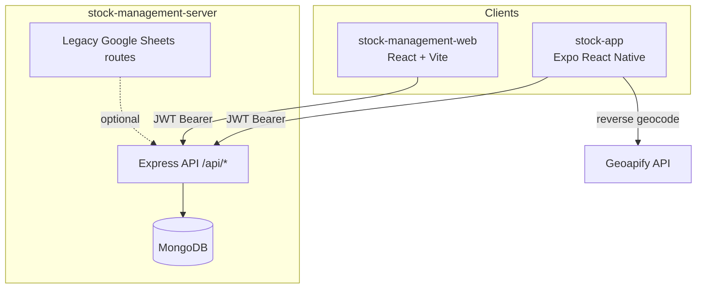

# Stock Management System

End-to-end platform for managing raw material stock (aluminium, copper, scrap), transfers to field operators, production tracking, customer sales, and workforce attendance. The system consists of three applications that share a single **Node.js / Express / MongoDB** backend.

| Application | Path | Audience | Purpose |
|-------------|------|----------|---------|
| **Web admin** | [`stock-management-web/`](stock-management-web/) | Owners, managers | Full operations dashboard in the browser |
| **Mobile app** | [`stock-app/`](stock-app/) | Core team (field staff) | Check-in/out, stock view, history on Android/iOS |
| **API server** | [`stock-management-server/`](stock-management-server/) | — | REST API, auth, business logic, database |

---

## Overview

The business workflow centers on **raw stock** held at the warehouse, **transfers** to core team members who produce finished goods, and **attendance** tied to each work session. Managers and owners use the web app to add stock, assign material, manage customers, record sales, and review team activity. Core team members use the mobile app to check in (with selfie and GPS), log production at checkout, and view their assigned quantities and history.



---

## User roles

| Role | Web app | Mobile app | Typical responsibilities |
|------|---------|------------|-------------------------|
| **owner** | Full access | — | Business overview, users, stock, customers, sales |
| **manager** | Full access (same nav as owner) | — | Day-to-day stock, transfers, team, customers, sales |
| **core_team** | Dashboard + stock transfer views | Primary user | Receive stock, check in/out, record production |
| **super_admin** | Backend-supported | — | Elevated API access (e.g. user creation) |

Public self-registration is disabled; managers/owners create credentials from the **Users** module.

---

## Features

### Web (`stock-management-web`)

- **Authentication** — Login, forgot/reset password, email verification, profile and password change
- **Role-based dashboards**
  - **Owner** — High-level business view
  - **Manager** — Stock tables, quantities, quick actions
  - **Core team** — Personal dashboard with check-in/out (web) and checkout form for production
- **Stock** — CRUD for aluminium, copper, scrap (kg/g/ton); quantity summaries
- **Stock transfer** — Assign raw material from manager/owner to core team members; history and filters
- **Users** — Create credentials, edit/deactivate users, view profiles and **attendance history** (with check-in photo modal)
- **Customers** — Customer CRUD, detail pages, finished-product purchase linkage
- **Sales** — Sales records linked to available finished items
- **Settings & profile** — Account management

### Mobile (`stock-app`)

- **Login** — Email/password against the same API
- **Dashboard** — Aluminium / copper / scrap quantities assigned to the user; finished products with filters (all / month / date range)
- **Check-in** — Front camera photo, GPS, reverse geocoding (city/address), optional fields sent to API
- **Check-out** — Modal form for wire used, items produced, location; ends attendance session
- **Stock transfer history** — Personal transfer log with month/range filters
- **Attendance history** — Past sessions
- **Navigation** — Drawer menu + bottom tabs (Home, Transfers)

### Server (`stock-management-server`)

- **REST API** under `/api/*` with consistent `success` / `error` response shape
- **JWT auth** — Token stored on user document; `Authorization: Bearer <token>`
- **Role middleware** — `Auth` + `authorize(...roles)` on routes
- **Modules** — Users, stock, stock transfer, attendance, item produced, customers, sales
- **Email** — Verification and password reset (Nodemailer)
- **Legacy** — Google Sheets integration routes (older stock flow; MongoDB is primary)

---

## App flow

### Web — manager / owner

```text
Sign in → Dashboard (role-specific)
    ├── Stock → add / edit / delete raw stock
    ├── Stock Transfer → transfer material to core team member
    ├── Customers → manage buyers → Customer details / purchases
    ├── Sales → record sales of finished goods
    └── Users → create credentials → User details → attendance history
```

### Web — core team

```text
Sign in → Core team dashboard
    ├── View assigned stock (via transfers)
    ├── Check IN (optional photo + location)
    ├── Check OUT → production form (wire used, items produced)
    └── Stock Transfer page (own history)
```

### Mobile — core team

```text
App launch → token check → Login or Dashboard
    ├── Check IN → camera + location + geocode → POST /api/attendance/check-in
    ├── Work session → view stock cards & products
    ├── Check OUT → form + location → POST /api/attendance/check-out
    ├── Stock Transfer History
    └── Attendance History (drawer)
```

### Attendance ↔ production

1. User **checks in** → `Attendance` record (`checked-in`) with optional photo, lat/lng, city, address.
2. User **checks out** → checkout payload updates attendance, links **item produced** data and wire usage.
3. Managers view history on web under **Users → User details → Attendance**.

---

## Project structure

```text
project/
├── README.md                          # This file — monorepo overview
│
├── stock-management-server/           # Backend API
│   ├── server.js                      # Express app entry, CORS, route mounting
│   ├── db.js                          # MongoDB connection
│   ├── middleware/auth.js             # JWT + role authorization
│   ├── models/                        # Mongoose schemas (user, stock, transfer, attendance, …)
│   ├── controllers/                   # Route handlers
│   ├── routes/                        # API route definitions
│   └── utils/                         # Email, pagination, validation
│
├── stock-management-web/              # Admin web UI
│   ├── src/
│   │   ├── App.jsx                    # React Router routes
│   │   ├── pages/                     # Login, Dashboard, Stock, Users, Sales, …
│   │   ├── components/                # UI, dashboards, tables, modals
│   │   ├── redux/                     # Auth + snackbar state
│   │   └── utils/                     # API client, permissions, validation
│   ├── services/                      # API service modules per domain
│   └── public/                        # Static assets, SPA redirects
│
└── stock-app/                         # Mobile app (Expo)
    ├── app/                           # Expo Router screens (login, dashboard, …)
    ├── src/
    │   ├── api/                       # Axios client + domain APIs
    │   ├── screens/                   # Login, Dashboard, history screens
    │   ├── components/                # Layout, cards, checkout modal
    │   └── utils/                     # Storage, validations
    ├── app.json                       # Expo config, permissions, EAS project
    └── eas.json                       # EAS Build profiles
```

---

## Tech stack

| Layer | Technologies |
|-------|----------------|
| **API** | Node.js, Express 5, MongoDB, Mongoose, JWT, bcrypt, Nodemailer, Cloudinary (dependency), Google APIs (legacy sheets) |
| **Web** | React 19, Vite 7, Redux Toolkit, React Router 7, Tailwind CSS, MUI, Axios / Apisauce |
| **Mobile** | Expo 54, React Native, Expo Router, AsyncStorage, Expo Image Picker / Location / Image Manipulator |
| **Deploy** | Web: Vercel (`vercel.json` SPA rewrites) · Mobile: EAS Build · API: any Node host (e.g. Render, EC2) |

---

## API overview

Base URL: `http://localhost:8000/api/` (development). All protected routes require `Authorization: Bearer <token>`.

| Prefix | Description |
|--------|-------------|
| `/api/user` | Login, logout, profile, password reset, user CRUD (admin) |
| `/api/stock` | Raw stock CRUD and quantity totals |
| `/api/stock-transfer` | Transfer to core team, quantities, history |
| `/api/attendance` | Check-in/out, status, history, producible items |
| `/api/item-produced` | Production totals, purchase-from-customer |
| `/api/customer` | Customer management |
| `/api/sales` | Sales CRUD, available items |

Health check: `GET /` → `server is working fine`.

---

## Setup

Run each part in its own terminal. **Start the server first**, then web and/or mobile.

### Prerequisites

- **Node.js** 20+ (LTS recommended)
- **MongoDB** instance (local or Atlas)
- **npm** or yarn
- For mobile: Expo Go or Android Studio / Xcode for native builds

### 1. Backend — `stock-management-server`

```bash
cd stock-management-server
npm install
cp .env.example .env   # create and fill — see table below
npm run dev              # nodemon on port 8000
```

### 2. Web — `stock-management-web`

```bash
cd stock-management-web
npm install
# Create .env with VITE_API_URL=http://localhost:8000/api/
npm run dev              # Vite — default http://localhost:5173
```

### 3. Mobile — `stock-app`

```bash
cd stock-app
npm install
cp .env.example .env
# Set EXPO_PUBLIC_API_URL (use machine IP for physical device, not localhost)
npx expo start
```

> **Physical device tip:** Use your computer’s LAN IP in `EXPO_PUBLIC_API_URL`, e.g. `http://192.168.1.10:8000/api/`, and ensure the server CORS `origin` includes the Expo dev URL.

---

## Environment variables

### `stock-management-server/.env`

| Variable | Required | Description |
|----------|----------|-------------|
| `MONGODB_URL` | Yes | MongoDB connection string |
| `JWT_SECRET` | Yes | Secret for signing JWTs |
| `PORT` | No | Server port (default `8000`) |
| `NODE_ENV` | No | `development` / `production` |
| `FRONTEND_URL` | Yes (prod) | Web app URL for CORS and email links |
| `SMTP_HOST`, `SMTP_PORT`, `SMTP_USER`, `SMTP_PASS` | For email | Password reset & verification |
| Google Sheets vars | Optional | Legacy `excelController` integration |

### `stock-management-web/.env`

| Variable | Description |
|----------|-------------|
| `VITE_API_URL` | API base URL, e.g. `http://localhost:8000/api/` |

### `stock-app/.env`

| Variable | Description |
|----------|-------------|
| `EXPO_PUBLIC_API_URL` | API base URL (trailing `/` recommended) |
| `EXPO_PUBLIC_GEOAPI_KEY` | Geoapify key for check-in reverse geocoding |

For **EAS production builds**, set mobile env vars in [Expo EAS secrets](https://docs.expo.dev/eas/environment-variables/) — local `.env` is not uploaded automatically.

---

## Development scripts

| Project | Command | Description |
|---------|---------|-------------|
| Server | `npm run dev` | Start with nodemon |
| Server | `npm start` | Production start |
| Web | `npm run dev` | Vite dev server |
| Web | `npm run build` | Production build |
| Web | `npm run preview` | Preview production build |
| Web | `npm run lint` | ESLint |
| Mobile | `npx expo start` | Expo dev server |
| Mobile | `npm run android` / `npm run ios` | Native run |
| Mobile | `npm run lint` | Expo ESLint |
| Mobile | `eas build --profile production` | Store-ready build |

---

## Deployment

| App | Suggested approach | Notes |
|-----|-------------------|--------|
| **Server** | Render, Railway, EC2, etc. | Set `MONGODB_URL`, `JWT_SECRET`, `FRONTEND_URL`; enable HTTPS |
| **Web** | Vercel (configured) | Set `VITE_API_URL` to production API; `vercel.json` handles SPA routing |
| **Mobile** | EAS Build + App Store / Play Store | Set `EXPO_PUBLIC_*` in EAS; use HTTPS API; see [`stock-app/README.md`](stock-app/README.md) |

**Production checklist**

1. Use **HTTPS** for the API everywhere (web, mobile, CORS).
2. Remove `usesCleartextTraffic` from `stock-app/app.json` once the API supports TLS.
3. Never commit `.env` files; rotate keys if they were ever exposed.
4. Align `FRONTEND_URL` (server CORS) with the deployed web URL.
5. Create initial owner/manager users via DB or admin scripts if registration is disabled.

---

## Data model (summary)

| Collection | Purpose |
|------------|---------|
| **users** | Accounts, roles, JWT token, email verification |
| **stocks** | Warehouse raw stock (aluminium, copper, scrap) |
| **stockTransfers** | Material moved from manager/owner → core team |
| **attendances** | Check-in/out sessions, photo, GPS, checkout linkage |
| **itemProduced** | Finished goods / production records |
| **customers** | Customer master data |
| **sales** | Sales transactions |

---

## Further reading

- Mobile-specific setup and EAS: [`stock-app/README.md`](stock-app/README.md)
- Server package: [`stock-management-server/package.json`](stock-management-server/package.json)

---

## Author

Lavish Dadwani — ISC license on server package; see individual project folders for details.
